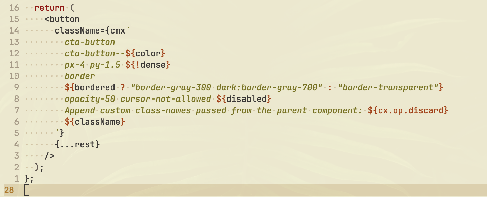

# cx-tagged-template

Specification and initial implementation of a sophisticated
class-name-expression DSL, written in TypeScript.

## Overview

CX (class-expressions) is a concatenative domain-specific language for
constructing class-name expressions with a minimal, yet, expressive syntax.
The language is initially designed to be used with tagged template literals in
JavaScript, but it can also be implemented in other languages that support
user-defined
[sigils](https://en.wikipedia.org/wiki/Macro_(computer_science)),
[macros](https://en.wikipedia.org/wiki/Macro_(computer_science)),
or other forms of syntactic extensions.

<picture>
  <source
    media="(prefers-color-scheme: dark)"
    srcset="./assets/jsx-sample-dark.png"
  />
  
</picture>

## Installation

The package `cx-tagged-template` is available on `npm` and can be installed
using any compatible package manager.

```sh
npm install cx-tagged-template
```

The code is compiled to both CJS and ESM formats, and supports tree-shaking.
When bundled, the code size can be reduced to approximately 2.17 KB (minified
and gzipped).

## Usage

To start using the `cx` template tag, you can import it from the package:

```js
import { cx } from 'cx-tagged-template';
```

Then, you can use the `cx` template tag to create class-name expressions:

```js
const className = cx`nice nice--better ${0} nice--best`; // "nice--best"
```

These code snippets demonstrate various features of the `cx` tagged template in
JavaScript:

<details>
  <summary>
    <strong>
      Example: Using non-string values as conditional expressions
    </strong>
  </summary>

  Non-string values can be used as condition tests in class-name expressions.
  When a non-string value is used as an interpolation, it will be evaluated as
  a conditional expression, like the `if` statements. If the value is truthy,
  the preceding values will be kept in the stack for the next operations.
  Otherwise, the values will be removed from the stack.

  Separating the non-string values from the preceding values with whitespaces
  is not necessary. However, it is recommended for better readability.

  ```js
  const bordered = false;

  cx`
  nice ${!bordered}
  bordered ${bordered}
  `;

  // Output: "nice"
  ```
</details>

<details>
  <summary>
    <strong>
      Example: Using interpolations for string concatenations
    </strong>
  </summary>

  String values can be embedded in the class-name expressions by using
  interpolations. When a placeholder is used with a string value and it is
  not separated by whitespaces, it will be concatenated with the preceding
  values.

  ```js
  const colors = {
    dark: {
      fg: "white",
    },
    light: {
      fg: "black",
    },
  };

  cx`text-${colors.light.fg} dark:text-${colors.dark.fg}`;

  // Output: "text-black dark:text-white"
  ```
</details>

<details>
  <summary>
    <strong>
      Example: Using interpolations for dynamic class-names
    </strong>
  </summary>

  String interpolations that are separated by whitespaces can be used to create
  dynamic class-names (e.g. based on variables or JavaScript expressions).

  ```js
  /**
   * @type {"" | "column" | "row"}
   */
  const flexDirection = "column";

  cx`flex ${flexDirection}`;

  // Output: "flex column"
  ```
</details>

<details>
  <summary>
    <strong>
      Example: Using string interpolations as conditional expressions
    </strong>
  </summary>

  For using string interpolations as condition tests, the `test` operator can
  be used. The `test` operator removes the preceding values only if the last
  value is falsy. Otherwise, unless it is a non-empty string, the operator
  removes only the last value from the stack.

  ```js
  /**
   * @type {"" | "column" | "row"}
   */
  const flexDirection = "";

  cx`
  nice
  flex ${flexDirection} ${cx.op.test} box
  `;

  // Output: "nice box"
  ```
</details>

<details>
  <summary>
    <strong>
      Example: Emitting values in the stack to the renderer explicitly
    </strong>
  </summary>

  Emitting is the process of sending the values in the stack to the renderer.
  Which ignores non-string values and guarantees that the string values are
  included in the final output (unless they are transformed to empty strings in
  the renderer layer by a user-defined transformation function). It also clears
  the stack for the next operations.

  When a line-feed or end-of-template is detected, the `emit` operator is
  automatically inserted by the parser. However, it can also be used
  explicitly.

  **Hint:** Every line is isolated from the operators that are placed in the
  other lines.

  ```js
  /**
   * @type {"" | "column" | "row"}
   */
  const flexDirection = "column";

  cx`
  nice
  flex ${flexDirection} ${cx.op.emit} box
  `;

  // Output: "nice flex column box"
  ```
</details>

<details>
  <summary>
    <strong>
      Example: Discarding values from the stack
    </strong>
  </summary>

  Sometimes, it may be necessary to disable some class-names temporarily. The
  `discard` operator can be used to clear the stack. Besides debugging
  purposes, it can also be used for comments.

  **Hint:** To comment out specific parts of a line, the `discard` operator can
  be used with the conjunction of the `emit` operator.

  ```js
  /**
   * @type {"" | "column" | "row"}
   */
  const flexDirection = "column";

  cx`
  nice
  flex ${flexDirection} ${cx.op.emit} Comment out. ${cx.op.discard} box
  Your lovely important note. ${cx.op.discard}
  `;

  // Output: "nice flex column box"
  ```
</details>

<details>
  <summary>
    <strong>
      Example: Deduplicating class-names
    </strong>
  </summary>

  The class-names emitted to the renderer are deduplicated by default. This
  behavior ensures that the same class-name is not repeated in the final
  output.

  ```js
  cx`foo foo bar`;

  // Output: "foo bar"
  ```
</details>

<details>
  <summary>
    <strong>
      Example: Transforming class-names e.g. with CSS Modules
    </strong>
  </summary>

  Transformer layer is an extension point that allows developers to customize
  the final output of the class-names by defining their own transformation
  functions. The transformer layer can be used to apply transformations such as
  mapping CSS Modules, adding prefixes or suffixes, or even removing class-names
  based on certain conditions by returning an empty string.

  For utilizing CSS Modules, the implementation provides a built-in extension
  that can be used to create a transformer that maps class-names to their
  respective values, which are imported from the CSS module file.

  **Hint:** A custom `cx` tag can be created per CSS module file.

  **Hint:** The custom `cx` tag can be named as `cmx` for distinguishing it
  from the default `cx` tag.

  ```js
  import { createCX } from "cx-tagged-template";
  import { createCSSModulesTransformer } from "cx-tagged-template/extensions/css-modules";

  import styles from "./styles.module.css";

  const cmx = createCX({
    transformer: createCSSModulesTransformer(styles),
  });

  const className = cmx`foo bar`;

  // Assuming that `styles.foo` equals to "bar", output: "bar"
  ```
</details>

<details>
  <summary>
    <strong>
      Example: Defining custom operators
    </strong>
  </summary>

  In addition to the built-in operators, custom operators can be defined by
  using the `defineOperator` function. The operator function should accept the
  stack and emit function as arguments.

  This feature can be used for creating custom operators that are specific to
  the project or the use-case.

  In the following example, a custom operator named `prefix` is defined. The
  operator accepts the last value as a prefix and prefixes the class-names that
  are placed before the prefix.

  **Hint:** The `cx.op` object can be used for registering and accessing the
  operators. This eliminates the need for importing the operators in every
  file.

  **Hint:** Each custom `cx` tag can have its own set of custom operators.

  ```js
  cx.op.prefix = defineOperator({
    name: "prefix",
    operate(
      stack,
      emit,
    )
    {
      // Get the last value by removing it from the stack.
      const prefix = stack.values.pop();

      // Keep the CX runtime error-free:
      // Ignore the values that the operator cannot be applied to.
      if (typeof prefix === "string")
      {
        // Iterate over the values in the stack.
        for (let i = 0; i < stack.values.length; i++)
        {
          // Get the value of the current index.
          const value = stack.values[i];

          // Keep the CX runtime error-free:
          // Ignore the values that the operator cannot be applied to.
          if (typeof value === "string")
          {
            // Mutate the value in the stack.
            stack.values[i] = `${prefix}${value}`;
          }
        }
      }
    },
  });

  cx`foo bar the- ${cx.op.prefix}`;

  // Output: "the-foo the-bar"
  ```
</details>

<details>
  <summary>
    <strong>
      Example: Using with JSX components
    </strong>
  </summary>

  The `cx` tagged template can be used inside JSX components for creating
  dynamic class-names, with an increased level of readability and
  maintainability compared to the traditional string concatenation methods.

  ```jsx
  const Button = (props) =>
  {
    const {
      bordered = false,
      className,
      color = "primary",
      dense = false,
      disabled = false,
      ...rest
    } = props;

    return (
      <button
        className={cmx`
          cta-button
          cta-button--${color}
          px-4 py-1.5 ${!dense}
          border
          ${bordered ? "border-gray-300 dark:border-gray-700" : "border-transparent"}
          opacity-50 cursor-not-allowed ${disabled}
          Append custom class-names passed from the parent component: {$cx.op.discard}
          ${className}
        `}
        {...rest}
      />
    );
  };
  ```
</details>

## Syntax and Semantics

The syntax and semantics of CX are designed to be minimal and easy to use,
allowing developers to create class-name expressions that are both dynamic and
composable. At the early stages of CX's design process, the language was not
actually inspired by concatenative programming concepts. However, as it
evolved, I found myself aligning with the principles of concatenative
programming languages and decided to embrace them. Since CX focuses only on
class-name expressions, it is tuned to be more developer-friendly on this
specific purpose. For example, in CX, line-feeds are considered as emit
operators, and non-string interpolations are considered as test operators.
This design choice provides a smooth developer experience by reducing
keystrokes, boilerplate codes, and cognitive load; while increasing the
expressiveness. Apart from these differences, CX's syntax and semantics can be
considered as a subset of other concatenative programming languages like Forth.

Before diving into the implementation details, it is worth mentioning that;
for ensuring the compatibility and correctness of the implementation with the
real-world class-names, the implementation has been thoroughly tested with over
21400 scenarios using a small dataset of class-names composed with different
syntaxes and patterns. The dataset is built by extracting various class-names
from the documentation of one of the most popular CSS frameworks,
`Tailwind CSS`.

To understand the syntax and semantics of CX, let's continue with this
JavaScript implementation; as it can also be used as a reference for integrating
the DSL into other languages. The implementation of `cx-tagged-template` is
composed of several key components, each responsible for a specific aspect of
the class-name-expression construction process.

In the following sections, we will explore each of these components in detail,
starting with the consolidator layer, which is responsible for transforming
tagged-template specific data into a more generalized format.

### Consolidator

The consolidator is tasked with combining template strings and expressions into
a unified stream of fragments, ensuring the correct order and type of
fragments.

For example, given the following template:

```js
cx`nice ${false} nice--better ${true}`;
```

The consolidator emits the following fragments to the parser:

```js
{ index: 0, type: 'template-string', value: 'nice ' }
{ index: 0, type: 'template-expression', value: false }
{ index: 1, type: 'template-string', value: ' nice--better ' }
{ index: 1, type: 'template-expression', value: true }
{ index: 3, type: 'template-feed', value: '' }
```

### Tokenizer

The tokenizer parses template-string fragments into tokens, which represent the
smallest units of the language.

As the fragments are received by the parser, parser may use the tokenizer to
convert string fragments into tokens. For the given fragments above, the
tokenizer emits the following tokens back to the parser:

```js
{ index: 0, type: 'character', value: 'n' }
{ index: 1, type: 'character', value: 'i' }
{ index: 2, type: 'character', value: 'c' }
{ index: 3, type: 'character', value: 'e' }
{ index: 4, type: 'whitespace', value: ' ' }
{ index: 5, type: 'eof', value: '' }
{ index: 0, type: 'whitespace', value: ' ' }
{ index: 1, type: 'character', value: 'n' }
{ index: 2, type: 'character', value: 'i' }
{ index: 3, type: 'character', value: 'c' }
{ index: 4, type: 'character', value: 'e' }
{ index: 5, type: 'character', value: '-' }
{ index: 6, type: 'character', value: '-' }
{ index: 7, type: 'character', value: 'b' }
{ index: 8, type: 'character', value: 'e' }
{ index: 9, type: 'character', value: 't' }
{ index: 10, type: 'character', value: 't' }
{ index: 11, type: 'character', value: 'e' }
{ index: 12, type: 'character', value: 'r' }
{ index: 13, type: 'whitespace', value: ' ' }
{ index: 14, type: 'eof', value: '' }
```

### Parser

The parser performs both syntactic and semantic analysis of the fragments and
tokens. It evaluates string interpolations and inserts implicit operators as
necessary.

Continuing the examples in the previous sections, the parser emits the
following values and operators to the interpreter:

```js
nice
false
[Function: operate] { [Symbol(__cx_operator__)]: { name: 'test' } }
nice--better
true
[Function: operate] { [Symbol(__cx_operator__)]: { name: 'test' } }
[Function: operate] { [Symbol(__cx_operator__)]: { name: 'emit' } }
```

### Stack

The stack serves as the storage layer for the interpreter, buffering
class-names and other values between the interpreter and the renderer.

### Operators

Operators are functions that modify the stack based on their specific behavior.
Built-in operators handle tasks such as emitting class-names to the renderer or
removing values from the stack, e.g.: conditional removal, etc.

To be compatible with the CSS selector syntax, all the punctuation characters
are allowed in the string fragments. Because of this, the language should not
have any operators that can be used outside of interpolation placeholders
(expression fragments). Besides the compatibility, this design choice also
helps reducing the cognitive load by making the language more predictable and
easier to use.

For example, in the following snippet, the `discard` operator can be seen as an
interpolation, which is specified inside a placeholder.

```js
cx`nice nice--better ${true} ${cx.op.discard} nice--best`; // "nice--best"
```

#### Built-in Operators

Respecting the minimalist nature of the language, a small set of operators is
provided to handle the most essential tasks. These operators are:

- [`discard`](./src/operators/discard.ts): Clears the stack. It can be used for
  comments or debugging purposes.
- [`emit`](./src/operators/emit.ts): Emits the string values in the stack to
  the renderer, then clears the stack for the next operations.
- [`test`](./src/operators/test.ts): Works as a conditional operator, removing
  values from the stack based on the last value.

#### Implicit Operators

Implicit operators are automatically inserted by the parser to handle
predefined behaviors. For example, the `test` operator is inserted when a
conditional expression (non-string and non-operator value) is detected. And the
`emit` operator is inserted when a line feed or template feed (end of template)
is detected.

### Interpreter

The interpreter manages the stack, pushing values onto it and executing
operators as required.

Back on the example in the parser section, as the parser emits the values and
operators, the interpreter processes them, updating the stack accordingly. Each
line in this demonstration represents the state of the stack after a value or
operator is processed:

```js
Stack: []
Stack: ["nice"]
Stack: ["nice", false]
Operation: test
Stack: []
Stack: ["nice--better"]
Stack: ["nice--better", true]
Operation: test,
Stack: ["nice--better"]
Operation: emit,
Stack: []
```

### Transformer

As an extension point, transformers allow developers to customize the final
output of the class-names by defining their own transformation functions. The
transformer layer can be used to apply transformations such as
[CSS Modules](https://github.com/css-modules/css-modules), adding prefixes or
suffixes, or even removing class-names based on certain conditions by returning
an empty string.

### Renderer

The renderer aggregates and deduplicates class-names, applying any specified
transformation. It concatenates the class-names into a single string, which
is returned to the template tag.

Once a class-name is emitted to the renderer; unless it is transformed to an
empty string by a user-defined transformer, it is guaranteed to be uniquely
present in the final output.

### Template Tag

The template tag serves as the public interface, allowing developers to create
class-name expressions. It orchestrates the flow of data through the various
components, ultimately returning the final result.

## References

- [Concatenative programming language - Wikipedia](https://en.wikipedia.org/wiki/Concatenative_programming_language)
- [Tagged templates - JavaScript - MDN](https://developer.mozilla.org/en-US/docs/Web/JavaScript/Reference/Template_literals#tagged_templates)

## License

This project is licensed under the
[MIT License](https://opensource.org/license/mit).
For more information, see the [LICENSE](./LICENSE) file.
